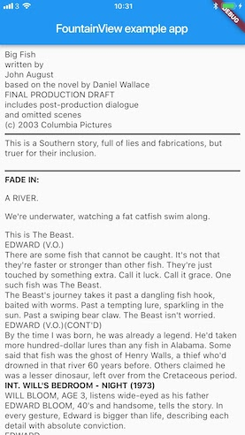

# FountainView

FountainView is a Flutter Plugin created using a Xamarin library written in F#

The purpose is to demonstrate the use of [Embeddinator-4000](https://github.com/mono/Embeddinator-4000) to create native libraries from Xamarin library that can then be reused in a Flutter application.

FountainView is a effectivly a renderer for [Fountain](https://fountain.io/) documents. It takes a single string and displays the formatted document.

## Usage
Usage is very straigt forward simply construct a new FountainView widget and provide it with a string containing valid [Fountain](https://fountain.io/) Markup text. 

    new FountainView(fountainText)
    
The text will be parsed and converted to HTML and displayed as using the [flutter_html](https://pub.dartlang.org/packages/flutter_html) plugin.

Note I plan to switch to the recently released official [webview_flutter](https://pub.dartlang.org/packages/webview_flutter) once it is stable.

## Acknowdledgments

This plugin is made using [FountainSharp](https://github.com/bryancostanich/FountainSharp) with thanks to [Bryan Costanich](https://github.com/bryancostanich)

FountainSharp is an F# based Fountain Markdown processor for use via .NET/Xamarin projects. FoutainSharp parses Fountain-formatted scripts and loads them into model that can be transformed or used for WYSIWYG editing.

It ships with a sample transformation engine that transforms Fountain markdown into HTML.
