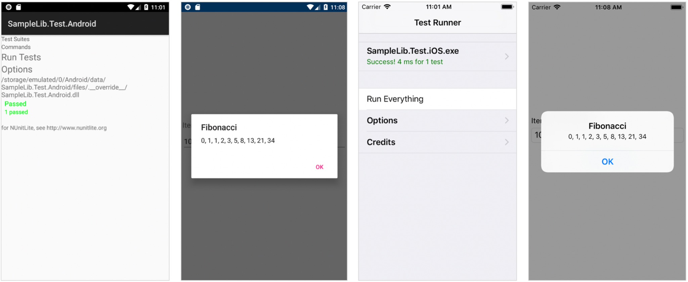

# Introduction 
This sample demonstrates the basic steps involved with incorporating a precompiled native C/C++ library as part of a Xamarin solution. It was created for use on the Xamarin show as a quick introduction to the topic with a focus on getting started with [P/Invoke](https://docs.microsoft.com/cpp/dotnet/calling-native-functions-from-managed-code?view=vs-2017) concepts.  



The solution is comprised of 3 high-level areas:  

**App**  
Xamarin.Forms application demonstrating the use of the library functionality by displaying a Fibonacci sequence of a specified length. Platform-specific references are added to the Android and iOS targets for use within the shared code. 

**Library**  
Provides the underlying functionality for the sample app by wrapping a native library. Platform-specific Android and iOS targets are used to include the respective native libraries which are subsequently exposed to .NET in a cross-platform manner via shared code. This was the main focus of the session.

**Test**  
Validates the library functionality using platform-agnostic unit test code along with targets for Android and iOS facilitating the use of the platform-specific [NUnit based test runner](https://github.com/nunit/nunit.xamarin).

# Getting started  
Download or clone this repo and then:

1. Change directory to scratch > xamarin > src > SampleApp 
2. Open SampleApp.sln in Visual Studio
3. Restore NuGet packages for the solution
4. Build the solution

## Running the tests
1. Set SampleLib.Test.{Android/iOS} as the **Startup project**
2. Press **COMMAND** + **RETURN** to start debugging
3. Press **Run Everything** to execute the test via the test runner

## Running the app
1. Set SampleApp.{Android/iOS} as the **Startup project**\
2. Press **COMMAND** + **RETURN** to start debugging
3. Press **Get Fibonacci** to show the sequence

**NOTE:**
You will need an Apple Developer account along with a suitable certificate and provisioning profile in order to deploy to an iOS device. 

# Caveat emptor
To quote the old adage, '*if it sounds to good to be true, it probably is*'. As mentioned at the end of the show, I'd glossed over quite a few concepts in an attempt to keep to the allotted 20 minutes. I also ran out of time (and forgot) before I could highlight one of the [Xamarin.iOS limitations](https://docs.microsoft.com/en-us/xamarin/ios/internals/limitations) related to the use of [delegate functions as callbacks](https://docs.microsoft.com/en-us/xamarin/ios/internals/limitations#reverse-callbacks) for unmanaged functions. 

Encountering a library implementing callbacks of this kind is uncommon in my own experience but since we already had a fairly extensive [walkthrough](https://github.com/xamarin/mobcat/blob/master/samples/cpp_with_xamarin/README.md) using more typical functions with blittable return types the path less traveled seemed like the right way to go. 
 

## The original sample
The original sample was principally focussed on two classes; SampleFuncsWrapper.cs and SampleFuncs.cs. The former exposed the unmanaged functions for use in C# and the latter provided a more friendly way to work with those functions encapsulating the internal workings namely the use of the handle. The original versions of these files are illustrated below. 

**SampleFuncsWrapper.cs:**
```cs
using System;
using System.Runtime.InteropServices;

namespace SampleLib
{
    internal static class SampleFuncsWrapper
    {
#if Android
        const string DllName = "libSample.so";
#else
        const string DllName = "__Internal";
#endif

        internal delegate void GetFibonacciCallback(IntPtr numbers, int size);

        [DllImport(DllName, EntryPoint = nameof(CreateSampleFuncs))]
        internal static extern SampleFuncsSafeHandle CreateSampleFuncs();

        [DllImport(DllName, EntryPoint = nameof(ReleaseSampleFuncs))]
        internal static extern void ReleaseSampleFuncs(SampleFuncsSafeHandle handle);

        [DllImport(DllName, EntryPoint = nameof(GetFibonacci))]
        internal static extern void GetFibonacci(SampleFuncsSafeHandle handle, int n, GetFibonacciCallback callback);
    }
}
```

**SampleFuncs.cs:**
```cs
using System;
using System.Collections.Generic;
using System.Runtime.InteropServices;
using System.Threading.Tasks;

namespace SampleLib
{
    public class SampleFuncs : IDisposable
    {
        readonly SampleFuncsSafeHandle handle;
        bool disposed;

        public SampleFuncs()
        {
            handle = SampleFuncsWrapper.CreateSampleFuncs();
        }

        public Task<IEnumerable<int>> GetFibonacciAsync(int n)
        {
            TaskCompletionSource<IEnumerable<int>> tcs = new TaskCompletionSource<IEnumerable<int>>();

            Task.Run(() =>
            {
                SampleFuncsWrapper.GetFibonacci(handle, n, (numberPtr, size) => 
                {
                    int[] numbersArray = new int[size];
                    Marshal.Copy(numberPtr, numbersArray, 0, size);

                    tcs.SetResult(new List<int>(numbersArray));
                });
            });

            return tcs.Task;
        }

        public IEnumerable<int> GetFibonacci(int n)
        {
            return GetFibonacciAsync(n).GetAwaiter().GetResult();
        }

        public void Dispose()
        {
            Dispose(true);
            GC.SuppressFinalize(true);
        }

        protected virtual void Dispose(bool disposing)
        {
            if (disposed)
                return;

            if (handle != null && !handle.IsInvalid)
                handle.Dispose();

            disposed = true;
        }
    }
}
```

## The issue
In order to quickly demonstrate the general concepts, an anonymous delegate was passed to an unmanaged function (SampleFuncsWrapper.GetFibonacci). This is perfectly fine in standard Mono since the JIT runtime handles this on our behalf thereby allowing the unmanaged code to reverse callback to the managed code. This approach falls flat when using AOT, which is required when building for an iPhone.

To address this we must make some changes to the current approach. Namely changing the anonymous delegate to a static method, since instance members are not supported, and conditionally decorating it with the [MonoPInvokeCallbackAttribute](https://docs.microsoft.com/dotnet/api/objcruntime.monopinvokecallbackattribute) for iOS build targets. 

## Updating the sample

We'll implement the new static callback in the SampleFuncsWrapper class and encapsulate the inner workings required to work with it subsequently wrapping and exposing the GetFibonacci unmanaged function to support asynchronous operations.

Let's start by adding the following namespaces to the top of our SampleFuncsWrapper class:

```cs
using System.Collections.Concurrent;
using System.Collections.Generic; 
using System.Threading.Tasks; 
```

In the same file, define the static version of the callback delegate:

```cs
#if __IOS__
[ObjCRuntime.MonoPInvokeCallback(typeof(SampleFuncsWrapper.GetFibonacciCallback))]
#endif
static void GetFibonacciCallbackDelegate(IntPtr numberPtr, int size)
{
   …
}
```

We need to reimplement the delegate functionality, from the original SampleFuncs class, within the new static. To do this we need to ensure that the TaskCompletionSource, we returned in the GetFibonacciAsync method, is available within the scope of the new static callback so we are still able to call SetResult on it. In the spirit of first-principles, we will handle this by maintaining a static dictionary of TaskCompletionSource objects keyed off the requested number of items. 

First, we define the ConcurrentDictionary at the top of the SampleFuncsWrapper class.

```cs
static ConcurrentDictionary<int, TaskCompletionSource<IEnumerable<int>>> fibonacciCallbacks = new ConcurrentDictionary<int, TaskCompletionSource<IEnumerable<int>>>();
        internal delegate void GetFibonacciCallback(IntPtr numbers, int size);
```

Next we make the existing SampleFuncsWrapper GetFibonacci method private and implement a new GetFibonacciAsync wrapper method in its place to encapsulate the use of the ConcurrentDictionary. The method will resolve an existing TaskCompletionSource, where a request for the same number of items is already in progress, or adds a new TaskCompletionSource to the ConcurrentDictionary for use later in the static callback. It then calls the original, now private, GetFibonacci method using the new static callback before returning the respective Task so it can be awaited by the caller.

```cs
internal static Task<IEnumerable<int>> GetFibonacciAsync(SampleFuncsSafeHandle handle, int n)
{
   var tcs = fibonacciCallbacks.GetOrAdd(n, new TaskCompletionSource<IEnumerable<int>>());
   Task.Run(() => GetFibonacci(handle, n, GetFibonacciCallbackDelegate));

   return tcs.Task;
} 
```

We can now complete the static callback implementation. This is the same code we used previously in the anonymous delegate but we now resolve (and remove) the appropriate TaskCompletionSource from the ConcurrentDictionary before calling SetResult.

```cs
#if __IOS__
[ObjCRuntime.MonoPInvokeCallback(typeof(SampleFuncsWrapper.GetFibonacciCallback))]
#endif
static void GetFibonacciCallback(IntPtr numberPtr, int size)
{
   TaskCompletionSource<IEnumerable<int>> tcs = null;

   if (!fibonacciCallbacks.TryRemove(size, out tcs))
      return;

   int[] numbersArray = new int[size];
   Marshal.Copy(numberPtr, numbersArray, 0, size);

   tcs.SetResult(new List<int>(numbersArray));
}
```

Lastly, we can update the GetFibonacciAsync method, in the SampleFuncs class, with an expression body definition calling the new GetFibonacciAsync wrapper method we added to the SampleFuncsWrapper class. 

```cs
public Task<IEnumerable<int>> GetFibonacciAsync(int n) => SampleFuncsWrapper.GetFibonacciAsync(handle, n);
```

The responsibility of our SampleFuncs class has been reduced somewhat to managing the handle to our unmanaged resource at this point. However, it's likely that this would include more functionality in more complex scenarios.

This should now build and run successfully on physical devices requiring AOT compilation. 

# Further Reading  

[NUnit](https://github.com/nunit/nunit.xamarin)  
[P/Invoke](https://docs.microsoft.com/cpp/dotnet/calling-native-functions-from-managed-code?view=vs-2017)  
[Safe Handle](https://docs.microsoft.com/dotnet/api/system.runtime.interopservices.safehandle?view=netframework-4.7.2)  
[Use C/C++ libraries with Xamarin](https://docs.microsoft.com/xamarin/cross-platform/cpp/)